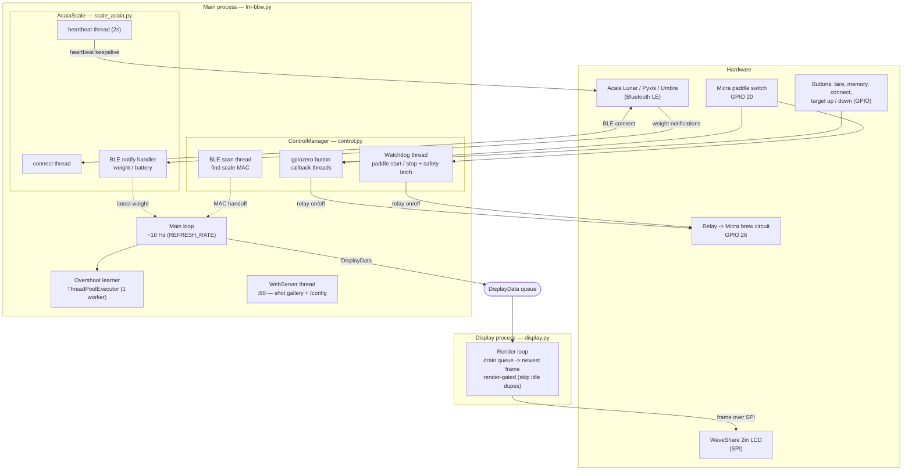
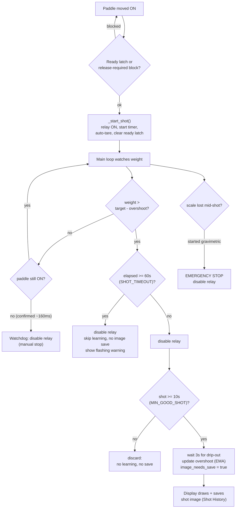
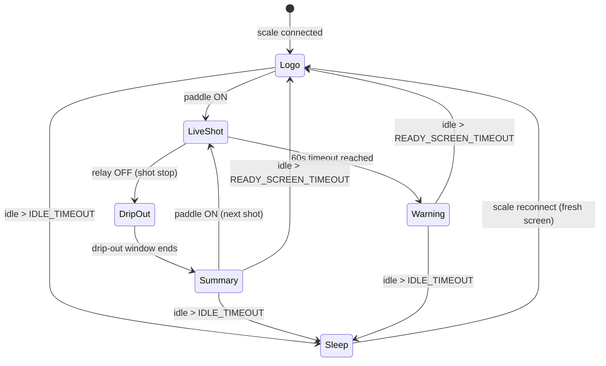
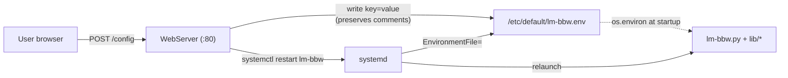

# LM-BBW — Architecture & Flow

Diagrams describing how the brew-by-weight controller is structured and how a shot
flows through it. All diagrams are [Mermaid](https://mermaid.js.org/) and render
directly on GitHub.

---

## 1. Components, processes & threads

The system is one **main process** (with several background threads) plus a
separate **display process**, communicating over a `multiprocessing.Queue`. The
display is isolated in its own process so frame rendering and SPI writes never
block control or Bluetooth logic.

**Thread/process legend**

- **Main loop** orchestrates everything at `REFRESH_RATE` (~0.1 s): checks sleep, keeps the scale connected, evaluates the target cutoff, and pushes a `DisplayData` snapshot onto the queue.
- **Watchdog thread** polls the paddle to start/stop shots and enforces the debounce + release latch (the emergency stop path).
- **BLE scan thread** searches for the scale's MAC and hands it to the main thread to connect (keeps BlueZ from being hammered).
- **Scale threads** (connect / heartbeat / notify) live inside `AcaiaScale`; the notify handler updates `weight`/`battery` asynchronously.
- **Display process** is fully separate; it drains the queue to the latest frame and only redraws when the picture actually changes.

---

## 2. Shot lifecycle (gravimetric)

**Key thresholds** (in `lm-bbw.py` / `control.py`):

- `target_minus_overshoot()` — cut point = target minus the learned drip-out margin.
- `SHOT_TIMEOUT_SECONDS = 60` — hard cap; stops the relay, skips learning, flags the warning.
- `MIN_GOOD_SHOT_DURATION = 10` — shorter shots don't update the learned overshoot.
- Overshoot learning is an EMA: `overshoot += alpha * (final_weight - target)`, clamped to a sane range.

---

## 3. Display screen state machine

What the LCD shows, and the transitions between states. The render loop applies
these from the `DisplayData` stream plus its own timers.

**Notes**

- **Logo** is the LM lion screen (also the "ready" state). After a shot it returns here once `READY_SCREEN_TIMEOUT` (default 180 s) of inactivity passes — and it is **latched**: weight wiggle or button presses won't revert it; only the next shot start does.
- **DripOut** keeps the graph and weight updating for `DRIP_OUT_WINDOW` (default 3.5 s); the cup/avg summary line is hidden until the window closes (but it is force-shown on the saved snapshot).
- **Sleep** = screen off + scale disconnected, after `IDLE_TIMEOUT` (default 300 s, longer than the ready-screen timeout). Reconnect wakes to a clean Logo screen.

---

## 4. Configuration flow

Settings live in environment variables. The web UI edits the env file and
restarts the service; values are read once at startup.

> The web server's `ENV_FILE_PATH` and the unit's `EnvironmentFile=` must point at
> the **same** file (`/etc/default/lm-bbw.env`), or saved changes won't reach the
> running service.

---

## File map

| File | Role |
|------|------|
| `lm-bbw.py` | Entry point; main loop, shot cutoff logic, overshoot learning, wiring |
| `lib/control.py` | `ControlManager`: buttons, relay, watchdog, scale connectivity, memory banks, sleep/ready timers |
| `lib/scale_acaia.py` | `AcaiaScale`: BLE scan/connect/heartbeat, Acaia protocol decode |
| `lib/display.py` | Display process: frame rendering, graph, screen states, image saving |
| `lib/webserver.py` | Shot-history gallery + `/config` editor |
| `lib/lcdconfig.py`, `lib/LCD_2inch*.py` | WaveShare SPI LCD drivers |
| `service/lm-bbw.service` | systemd unit |
| `service/lm-bbw.env` | default configuration |