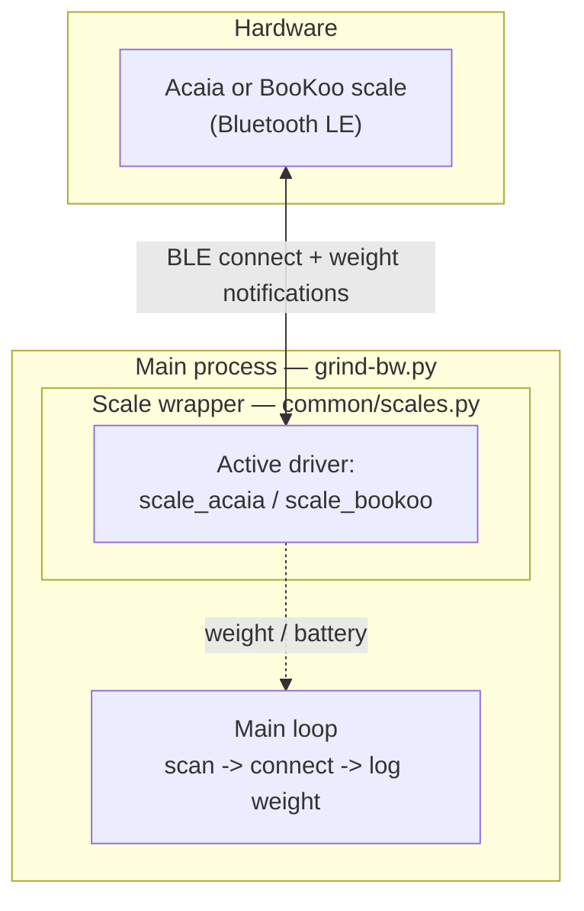

# GRIND-BW — Architecture & Status

Grind-by-weight controller for a coffee grinder, built on the shared `common/` core of the coffee-by-weight repo. This document describes the current skeleton and the planned structure; it will grow alongside the implementation, in the same style as the [LM-BBW architecture doc](../lm-bbw/LM-BBW_Architecture.md).

> **Status: skeleton.** The shared scale stack is wired up and working (scan, connect, stream weight from Acaia or BooKoo scales). Grinder-specific logic — dosing, motor control, display screens, web UI — is not yet implemented.

---

## 1. Current components

What runs today when the `grind-bw` service starts.

The main loop finds a supported scale (remembering the last one in `/opt/grind-bw/mac.save`), connects through the vendor-neutral `Scale` wrapper, and logs the live weight. All BLE scans are serialized through the shared lock in `common/ble.py`, exactly as in LM-BBW.

## 2. Planned components

The intended end state mirrors the LM-BBW patterns, adapted to grinding:

- **Dose controller** (`app/control.py`) — target dose with memory banks, a relay driving the grinder motor, stop at target minus a learned overshoot (grind-retention compensation), and the same EMA overshoot learning as LM-BBW shots.
- **Display process** (`app/display.py`) — live weight + dose progress on a WaveShare SPI screen, reusing `common/lcd/` drivers and `common/font/`.
- **Web UI** (`app/webserver.py`) — configuration editor and the Bluetooth scale setup (scan & pin) page.
- **Safety** — hard timeout on the motor relay and an emergency stop if the scale disconnects mid-grind.

## 3. File map

Paths are relative to the `coffee-by-weight` repo root. `common/` is the shared package; on a deployed Pi it is copied into `/opt/grind-bw/` next to `app/` by `deploy.sh`.

| File | Role |
|------|------|
| `grind-bw/grind-bw.py` | Entry point; current skeleton main loop |
| `grind-bw/app/` | Grinder-specific modules (to be implemented) |
| `grind-bw/service/grind-bw.service` | systemd unit |
| `grind-bw/service/grind-bw.env` | default configuration |
| `common/scales.py`, `common/scale_*.py`, `common/ble.py` | shared scale stack (see LM-BBW architecture doc) |
| `common/lcd/`, `common/font/` | shared display drivers and fonts |