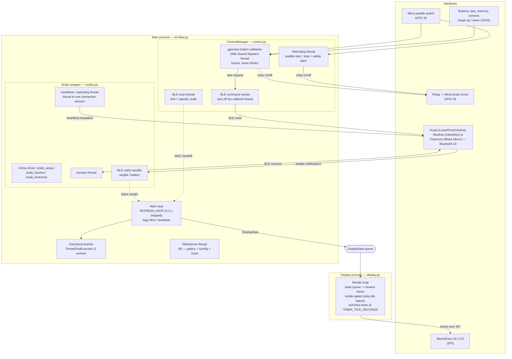
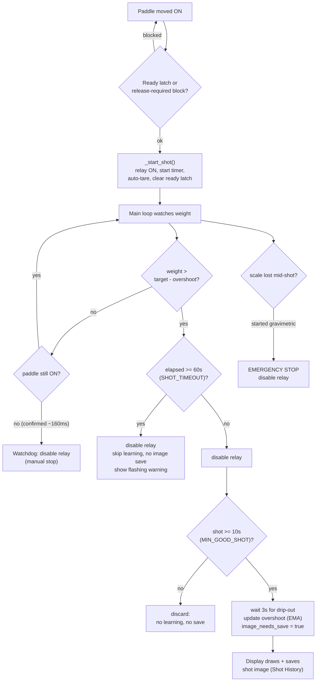
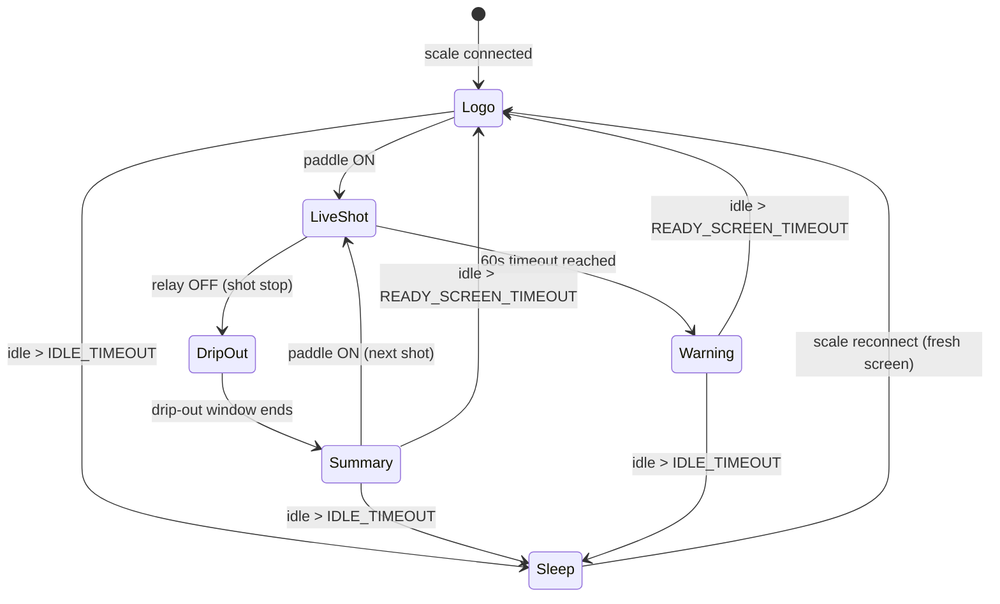
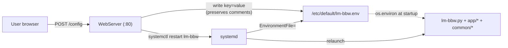

# LM-BBW — Architecture & Flow

Diagrams describing how the brew-by-weight controller is structured and how a shot flows through it. All diagrams are [Mermaid](https://mermaid.js.org/) and render directly on GitHub.

---

## 1. Components, processes & threads

The system is one **main process** (with several background threads) plus a separate **display process**, communicating over a `multiprocessing.Queue`. The display is isolated in its own process so frame rendering and SPI writes never block control or Bluetooth logic.

**Thread/process legend**

- **Main loop** orchestrates everything at `REFRESH_RATE` (code default 0.1 s; the shipped env file uses 0.3 s): checks sleep, keeps the scale connected, evaluates the target cutoff, and pushes a `DisplayData` snapshot onto the queue. Every `LOOP_HEARTBEAT_SECONDS` it logs an `Alive:` line with the achieved loop rate, so a stalled loop is distinguishable from a quiet machine.
- **Watchdog thread** polls the paddle to start/stop shots and enforces the debounce + release latch (the emergency stop path).
- **BLE scan thread** searches for a supported scale, classifies it by vendor, and hands it to the main thread to connect. Every BLE scan (discovery, the web scan, and each driver's connect-scan) is serialized through one lock in `common/ble.py` so the adapter is never scanned by two paths at once.
- **Button callbacks** all arrive on **one** gpiozero dispatch thread, so a handler that blocks takes every button down with it while polled inputs (the paddle watchdog, the scale-connect switch) keep working. Each callback is wrapped to log its entry and exit, flag slow handlers, and contain exceptions.
- **BLE command worker** runs anything that writes to the scale (currently the tare), because a `write_command()` can block inside BlueZ for an unbounded time and must never do so on the callback thread. Its queue is bounded: if a command is stuck, further ones are dropped with a warning instead of queueing.
- **Scale wrapper** (`scales.py`) holds the active vendor driver (`scale_acaia`, `scale_bookoo` or `scale_timemore`) behind a common interface; the driver's connect / heartbeat / notify threads update `weight`/`battery` asynchronously. Each connection is a **session**: `connect()` mints a fresh stop event and passes it to those threads, so a thread left over from a previous session exits instead of adopting the new connection, and all writes are serialized by a per-scale lock.
- **Display process** is fully separate; it drains the queue to the latest frame and only redraws when the picture actually changes.

---

## 2. Shot lifecycle (gravimetric)

**Key thresholds** (in `lm-bbw.py` / `control.py`):

- `target_minus_overshoot()` — cut point = target minus the learned drip-out margin.
- `SHOT_TIMEOUT_SECONDS = 60` — hard cap; stops the relay, skips learning, flags the warning.
- `MIN_GOOD_SHOT_DURATION = 10` — shorter shots don't update the learned overshoot.
- Overshoot learning is an EMA: `overshoot += alpha * (final_weight - target)`, clamped to a sane range.

---

## 3. Display screen state machine

What the LCD shows, and the transitions between states. The render loop applies these from the `DisplayData` stream plus its own timers.

**Notes**

- **Logo** is the LM lion screen (also the "ready" state). After a shot it returns here once `READY_SCREEN_TIMEOUT` (default 180 s) of inactivity passes — and it is **latched**: weight wiggle or button presses won't revert it; only the next shot start does.
- **DripOut** keeps the graph and weight updating for `DRIP_OUT_WINDOW` (default 3.5 s); the cup/avg summary line is hidden until the window closes (but it is force-shown on the saved snapshot).
- **Sleep** = screen off + scale disconnected, after `IDLE_TIMEOUT` (default 300 s, longer than the ready-screen timeout). Reconnect wakes to a clean Logo screen.
- **LiveShot** redraws on every frame from the main loop, and additionally self-ticks every `TIMER_TICK_SECONDS` (default 0.1 s) so the brew timer advances smoothly even though frames arrive at the slower `REFRESH_RATE`. A tick reuses the last frame with only the elapsed time advanced, so nothing else on screen — graph, weight, smoothing — is affected. Ticking stops when the paddle opens, and gives up (with a warning) if no real frame arrives for 2 s. All display timing uses `time.monotonic()`, so an NTP clock step can't expire the drip-out window or freeze the warning flash mid-shot.
- Each finished shot logs one `Shot render:` line with the frame count, average and worst render time against the tick budget — the measurement that says whether this hardware can actually sustain the configured tick rate.

---

## 4. Configuration flow

Settings live in environment variables. The web UI edits the env file and restarts the service; values are read once at startup.

> The web server's `ENV_FILE_PATH` and the unit's `EnvironmentFile=` must point at the **same** file (`/etc/default/lm-bbw.env`), or saved changes won't reach the running service.

---

## File map

Paths are relative to the `coffee-by-weight` repo root. `common/` is the shared package (also used by other apps such as grind-bw); on a deployed Pi it is copied into `/opt/lm-bbw/` next to `app/` by `deploy.sh`.

| File | Role |
|------|------|
| `lm-bbw/lm-bbw.py` | Entry point; main loop, shot cutoff logic, overshoot learning, wiring |
| `lm-bbw/app/control.py` | `ControlManager`: buttons, relay, watchdog, scale connectivity + selection/pinning, memory banks, sleep/ready timers |
| `common/scales.py` | Vendor-neutral layer: combined scan + classification, factory, and the `Scale` wrapper that delegates to a backend |
| `common/scale_acaia.py` | `AcaiaScale`: BLE scan/connect/heartbeat, Acaia protocol decode |
| `common/scale_bookoo.py` | `BookooScale`: BLE connect, BooKoo Ultra/Mini protocol decode |
| `common/scale_timemore.py` | `TimemoreScale`: BLE connect, Timemore Black Mirror (TES017) protocol decode |
| `common/ble.py` | Single lock serializing all BLE adapter scans |
| `lm-bbw/app/display.py` | Display process: frame rendering, graph, screen states, image saving |
| `lm-bbw/app/webserver.py` | Shot-history gallery + `/config` editor + `/scan` scale setup |
| `common/lcd/` | WaveShare SPI LCD drivers |
| `lm-bbw/service/lm-bbw.service` | systemd unit |
| `lm-bbw/service/lm-bbw.env` | default configuration |