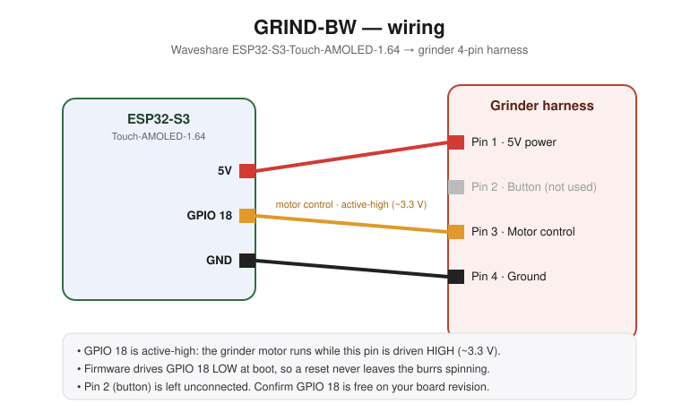
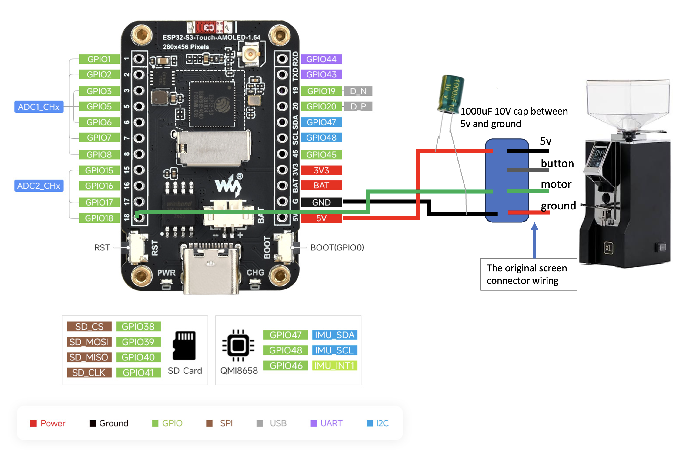

# GRIND-BW

Grind-by-weight controller for an espresso grinder, built on the
**Waveshare ESP32-S3-Touch-AMOLED-1.64**. It connects to a Bluetooth coffee
scale (Acaia or BooKoo), shows the live weight on the touch screen, lets you
dial in a target dose, and runs the grinder until the scale reaches that target.

Status: **in development** — the firmware is working end to end (display, touch,
scale, weight-controlled grinding); the enclosure/mount is a parametric starting
point still being fitted.

## What it does

- Connects to a Bluetooth scale (Acaia Lunar/Pyxis/etc. or BooKoo) and streams
  the live weight.
- Touch UI: a big live-weight readout, a round target button you tap to grind,
  − / + to set the dose, and a bottom bar with Bluetooth status, color-coded
  battery %, and a settings gear.
- Grind sequence: tare → 1 s settle → motor on → coarse cut 0.5 g before target
  → short motor pulses that creep the dose up to the exact target.
- Remembers the chosen scale and locks to it; the scale is changed only from the
  on-screen settings gear.

## Hardware

- **Controller:** Waveshare ESP32-S3-Touch-AMOLED-1.64 — 280×456 CO5300 QSPI
  AMOLED with FocalTech FT3168 capacitive touch.
  <https://www.waveshare.com/wiki/ESP32-S3-Touch-AMOLED-1.64>
- **Scale:** any supported Bluetooth scale — Acaia (Lunar, Pyxis, Lunar 2021,
  Pearl…) or BooKoo.
- **Grinder:** a Eureka Mignon. The controller plugs into the grinder's
  original screen connector and drives the motor from a single active-high GPIO
  (see Wiring).

### Wiring

High-level connection:



Detailed wiring against the actual board pinout and the grinder's connector:



| ESP32-S3 | Grinder connector | Notes |
|---|---|---|
| 5V | 5V | powers the board from the grinder |
| GPIO 18 | motor | **active-high**: motor runs when driven HIGH (~3.3 V) |
| GND | ground | |
| — | button | not used |

This taps the Eureka Mignon's **original screen connector** — the controller
drops in where the stock display was (5V / button / motor / ground). A
**1000 µF 10 V capacitor across 5V and GND** smooths the rail so the motor
switching doesn't disturb the board or the scale reading.

The firmware drives GPIO 18 LOW at boot, so a reset never leaves the burrs
spinning. Confirm GPIO 18 is free on your board revision (the panel, touch, and
PSRAM claim many pins).

## Firmware

The PlatformIO project lives in [`firmware/`](firmware/).

It targets **Arduino-ESP32 core 3.x** via the community **pioarduino** platform —
the CO5300 panel driver needs core 3.x, which the stock `espressif32` platform
doesn't yet ship. Libraries: NimBLE-Arduino, LVGL 8.x, and GFX Library for
Arduino; the scale driver is a self-contained local library in
`firmware/lib/scale/`.

Build and flash (from the `firmware/` folder, the one containing
`platformio.ini`):

```bash
pio run -t upload
pio device monitor
```

Notes that save time:

- Serial output is routed to the native USB-C (`ARDUINO_USB_MODE=1` +
  `ARDUINO_USB_CDC_ON_BOOT=1`); without those, `Serial.print` goes to the UART
  pins and the USB monitor stays blank.
- On macOS, install PlatformIO via pipx on a stable Python (e.g. 3.12) rather
  than a bleeding-edge one — the platform's post-install step can fail under
  very new Python builds.
- The first build downloads the whole core 3.x toolchain, so it's slow and
  needs internet.

### Board-specific values (verified for this board)

These were originally guesses and are now confirmed working, cross-checked
against the reference project credited below:

- QSPI pins: CS 9, SCK 10, D0–D3 11–14, RST 21; panel 280×456.
- CO5300 constructor offsets `20, 0, 180, 24` (center the active area).
- Flush with `draw16bitBeRGBBitmap` paired with `LV_COLOR_16_SWAP 1` (correct
  colors; the little-endian call renders magenta).
- Touch FT3168 on I2C SDA 47 / SCL 48, address 0x38.

## Using it

1. First boot: it adopts the first supported scale it finds, then locks to it.
2. Set the dose with − / +. Tap the red circle to grind.
3. It tares, waits a second, runs the motor to ~0.5 g short of target, then
   pulses up to the exact target and stops.
4. To use a different scale, tap the gear and pick one — that choice is saved
   and becomes the locked scale. It will not switch to another scale on its own,
   even if a different one is nearby.

## Tuning

All knobs are at the top of [`firmware/src/config.h`](firmware/src/config.h):

- Dose: `TARGET_DEFAULT_G`, `TARGET_MIN_G`, `TARGET_MAX_G`, `TARGET_STEP_G`.
- Approach: `APPROACH_MARGIN_G` (coarse cut distance, default 0.5 g),
  `PULSE_MS` (pulse length — raise it if your grinder's motor is slow to spin up
  and pulses produce nothing), `TARGET_EPSILON_G`.
- Timing/safety: `PRE_GRIND_TARE_MS`, `MAX_GRIND_SECONDS`, `MAX_FINE_PULSES`.

## Enclosure / mount

A 3D-printable screen adapter that holds the board and mounts it on the grinder
is in [`docs/Waveshare-AMOLED-1_64-adapter.stl`](docs/Waveshare-AMOLED-1_64-adapter.stl) —
slice and print it directly.

## Repository layout

```
grind-bw/
├── README.md                 ← this file
├── docs/
│   ├── wiring-diagram.svg                 ← high-level schematic
│   ├── ESP32-S3-wiring-diagram.png        ← detailed wiring
│   └── Waveshare-AMOLED-1_64-adapter.stl  ← printable screen mount
└── firmware/                 ← PlatformIO project
    ├── platformio.ini
    ├── include/lv_conf.h
    ├── lib/scale/            ← reusable Acaia/BooKoo BLE driver
    └── src/                  ← config, grinder, ui, board bring-up, main
```

## Credits

- Waveshare ESP32-S3-Touch-AMOLED-1.64 wiki.
- [jaapp/smart-grind-by-weight](https://github.com/jaapp/smart-grind-by-weight)
  — a grind-by-weight project on the same board; used to confirm the display
  offsets, color order, and touch pins. (It uses a built-in HX711 load cell
  rather than a Bluetooth scale, so its weight path differs from this one.)

## Disclaimer

Hobby project, provided as-is. You are responsible for the electrical and
mechanical safety of wiring a microcontroller to a mains-powered grinder motor.