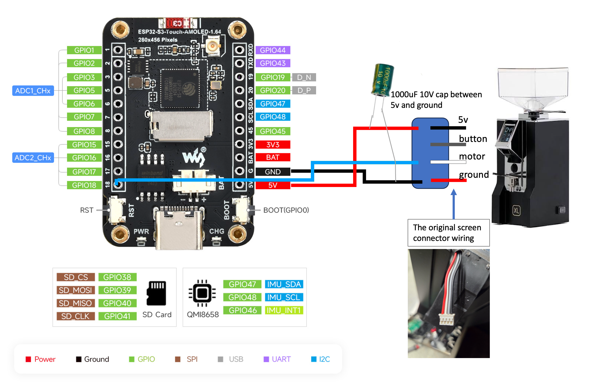

# GRIND-BW

Grind-by-weight controller for an espresso grinder, built on the
**Waveshare ESP32-S3-Touch-AMOLED-1.64**. It connects to a Bluetooth coffee
scale (Acaia, BooKoo or Timemore), shows the live weight on the touch screen,
lets you
dial in a target dose, and runs the grinder until the scale reaches that
target.
It can also grind on a fixed timer instead, for when you'd rather not use a scale.

Status: **in development** — the firmware works end to end: display, touch,
Bluetooth scale, and both weight- and time-based grinding. A printable screen
mount for the Mignon is included.

## What it does

- Three grind modes, selectable in the settings screen:
  - **Pulse** (by weight, default): connects to a Bluetooth scale (Acaia
    Lunar/Pyxis/etc., BooKoo, or Timemore) and grinds to a target dose in grams.
    Sequence: tare → 1 s settle → coarse cut to ~0.9 g before target → short
    motor pulses that creep up to the exact target. Each pulse is tapered to
    the remaining deficit, and the grind stops one pulse early when another
    burst would overshoot by more than stopping now undershoots. Precise on
    every shot, but takes a few extra seconds of pulsing.
  - **Learn** (by weight): also grinds to a target dose, but in a single run —
    it cuts the motor when the scale reads a learned offset below target (0.8 g
    to start), lets the dose settle, then compares to target. If it's off by
    more than 0.1 g, it shifts the cut point by half the error for next time, so
    the offset converges on your grinder's "coast" (the coffee that lands after
    the motor stops). Faster (no pulsing) and self-tuning; the learned offset is
    remembered across reboots. Both weight modes show the live weight in `gram`.
  - **Time**: grinds for a fixed number of seconds — no scale needed. The top
    readout becomes a countdown in `seconds` from the target time to zero.
- Touch UI, top to bottom: − / + either side of the big readout (both thumb
  targets in the upper half of the screen), then a large round start/stop
  circle showing the active target (dose or time), then a bottom bar with
  Bluetooth status, color-coded battery %, and a settings gear, and a message
  line under it. The circle is styled as a gear whose teeth spin while the
  motor is running; a finished grind flashes it green with "HERE YOU GO" and
  holds the final dose on screen for 10 s.
- Safety in the UI: − / + are locked while a grind is running, and the start
  circle is disabled in the weight modes until a scale is connected. If the
  scale drops mid-grind the motor is cut immediately ("SCALE LOST" on serial).
- Remembers the chosen scale and locks to it; the scale and the grind mode are
  changed from the on-screen settings gear.

## Hardware

- **Controller:** Waveshare ESP32-S3-Touch-AMOLED-1.64 — 280×456 CO5300 QSPI
  AMOLED with FocalTech FT3168 capacitive touch.
  <https://www.waveshare.com/wiki/ESP32-S3-Touch-AMOLED-1.64>
- **Scale:** any supported Bluetooth scale — Acaia (Lunar, Pyxis, Lunar 2021,
  Pearl…), BooKoo, or Timemore (Black Mirror family, model TES017). Scales are
  recognised by advertised name: `ACAIA`, `PYXIS`, `UMBRA`, `LUNAR`, `PROCH` →
  Acaia; `BOOKOO` → BooKoo; `TIMEMORE`, `TES017`, `BLACK MIRROR`,
  `BLACKMIRROR` → Timemore. If yours advertises under some other name, add the
  prefix to the matching list at the top of
  [`firmware/lib/scale/scale.cpp`](firmware/lib/scale/scale.cpp).

  > **Timemore is implemented but not yet bench-verified.** The driver follows
  > the vendor spec, but the spec leaves two things unstated and both defaults
  > are assumptions — see [Verifying a Timemore scale](#verifying-a-timemore-scale)
  > before trusting a dose. Acaia and BooKoo are confirmed working.
- **Grinder:** a Eureka Mignon. The controller plugs into the grinder's
  original screen connector and drives the motor from a single active-high GPIO
  (see Wiring).

### Wiring

High-level connection:


Detailed wiring against the actual board pinout and the grinder's connector:



| ESP32-S3 | Grinder connector | Notes |
|---|---|---|
| 5V | 5V | powers the board from the grinder |
| GPIO 18 | motor | **active-high**: motor runs when driven HIGH (~3.3 V) |
| GND | ground | |
| — | button | not used |

This taps the Eureka Mignon's **original screen connector** — the controller
drops in where the stock display was (5V / button / motor / ground). A
**1000 µF 10 V capacitor across 5V and GND** smooths the rail so the motor
switching doesn't disturb the board or the scale reading.

The firmware drives GPIO 18 LOW at boot, so a reset never leaves the burrs
spinning. Confirm GPIO 18 is free on your board revision (the panel, touch, and
PSRAM claim many pins).

## Firmware

The PlatformIO project lives in [`firmware/`](firmware/).

It targets **Arduino-ESP32 core 3.x** via the community **pioarduino** platform —
the CO5300 panel driver needs core 3.x, which the stock `espressif32` platform
doesn't yet ship. Libraries: NimBLE-Arduino, LVGL 8.x, and GFX Library for
Arduino; the scale driver is a self-contained local library in
`firmware/lib/scale/`, which holds all three protocols (Acaia's handshake +
heartbeat, BooKoo's fixed command frames, Timemore's CRC-checked framing).

Build and flash (from the `firmware/` folder, the one containing
`platformio.ini`):

```bash
pio run -t upload
pio device monitor
```

Or use [`build.sh`](build.sh) from `esp32/` — it cleans, builds and uploads, and
returns you to the directory you started in even if `pio` fails:

```bash
./build.sh              # clean + build + upload
./build.sh -m           # …and open the serial monitor afterwards (also: --monitor, monitor)
```

Notes that save time:

- Serial output is routed to the native USB-C (`ARDUINO_USB_MODE=1` +
  `ARDUINO_USB_CDC_ON_BOOT=1`); without those, `Serial.print` goes to the UART
  pins and the USB monitor stays blank.
- On macOS, install PlatformIO via pipx on a stable Python (e.g. 3.12) rather
  than a bleeding-edge one — the platform's post-install step can fail under
  very new Python builds.
- The first build downloads the whole core 3.x toolchain, so it's slow and
  needs internet.

### Board-specific values (verified for this board)

These were originally guesses and are now confirmed working, cross-checked
against the reference project credited below:

- QSPI pins: CS 9, SCK 10, D0–D3 11–14, RST 21; panel 280×456.
- CO5300 constructor offsets `20, 0, 180, 24` (center the active area).
- Flush with `draw16bitBeRGBBitmap` paired with `LV_COLOR_16_SWAP 1` (correct
  colors; the little-endian call renders magenta).
- Touch FT3168 on I2C SDA 47 / SCL 48, address 0x38.

## Using it

Pick a grind mode in the settings gear — **Pulse** (by weight, default),
**Learn** (by weight), or **Time**. The choice is saved across reboots.

**Pulse (weight)**

1. First boot: it adopts the first supported scale it finds, then locks to it.
2. Set the dose with − / +. Tap the circle to grind.
3. It tares, waits a second, runs the motor to ~0.9 g short of target, then
   pulses up to the exact target and stops.
4. To use a different scale, tap the gear and pick one — that choice is saved
   and becomes the locked scale. It won't switch to another on its own, even if
   a different one is nearby.

**Learn (weight)**

1. Set the dose with − / +. Tap the circle to grind.
2. It tares, waits a second, then grinds in one run and cuts the motor when the
   scale reads the learned offset below target (0.8 g on the very first grind).
3. After the dose settles it checks the result: if it's more than 0.1 g off, it
   moves the cut point by half the error, so the next grind lands closer. Give
   it a few shots to dial in; the learned offset survives reboots.

**Time**

1. Set the time with − / + (0.1 s steps). No scale required.
2. Tap the circle — the top counts down from the target time to zero, the motor
   runs for that long, then stops.

### Verifying a Timemore scale

The Timemore driver is written from the vendor spec
(`doc/BT_Scales/Timemore/protocols.md`), but the spec does not state two things
the firmware has to guess. Both defaults are assumptions — the same two that
`common/scale_timemore.py` flags in its own header — and neither has been
checked against real hardware. Both knobs sit at the top of the Timemore section
in [`firmware/lib/scale/scale.cpp`](firmware/lib/scale/scale.cpp).

1. **Weight scaling** (`TIMEMORE_WEIGHT_DIV`, default `100.0f` = 0.01 g per
   count). §5.1 gives weight as a 4-byte Int32 with no unit — it states the unit
   for flow rate but not for weight. Put a known load on the scale and compare
   the controller readout against the scale's own display: if it reads 10× or
   100× off, set the divisor to `10.0f` or `1000.0f`. **A wrong divisor means
   the target is never reached and every grind runs to `MAX_GRIND_SECONDS`.**
2. **CRC byte order** (`TIMEMORE_CRC_BIG_ENDIAN`, default `1` = MSB first). §3
   names the checksum "CRC-16/IBM, poly 0x8005, init 0xFFFF" — the MODBUS
   parameter set, whose native wire order is LSB first — while the same section
   declares all multi-byte fields big-endian. Incoming frames are not
   CRC-checked, so this affects only commands: **weight can stream perfectly
   while the scale silently ignores every tare.** Tap the circle and watch
   whether the scale zeroes. If it doesn't, set this to `0`.

To see the raw frames, set `TIMEMORE_LOG_PACKETS` to the number of
notifications you want hex-dumped on the serial monitor, then put it back to `0`
— logging from the notify context floods the USB-CDC buffer.

Once both are confirmed on hardware, drop the caveat from the Hardware section
above.

## Tuning

Most knobs are at the top of [`firmware/src/config.h`](firmware/src/config.h)
(the one exception is the BooKoo power-off timer, noted at the end):

- Dose (weight modes): `TARGET_DEFAULT_G`, `TARGET_MIN_G`, `TARGET_MAX_G`, `TARGET_STEP_G`.
- Time (time mode): `TIME_DEFAULT_S`, `TIME_MIN_S`, `TIME_MAX_S`, `TIME_STEP_S` (0.1 s steps).
- Pulse approach: `APPROACH_MARGIN_G` (coarse cut distance, default 0.9 g) and
  the tapered burst — `PULSE_MS_PER_G` (ms of motor per gram still missing,
  default 180), clamped between `PULSE_MIN_MS` (22, the final nudges) and
  `PULSE_MS` (80, the longest burst). If you land slightly over, lower
  `PULSE_MS_PER_G` or `PULSE_MIN_MS`; if it takes too many pulses or lands
  under, raise them. `TARGET_EPSILON_G` (0.05 g) is how close counts as done.
- Learn approach: `LEARN_STOP_OFFSET_G` (initial cut offset, default 0.8 g),
  `LEARN_RATE` (fraction of the error corrected each grind, default 0.5 —
  lower it for slower/steadier convergence), `LEARN_DEADBAND_G` (leave the
  offset alone when within this of target, default 0.1 g), and the
  `LEARN_OFFSET_MIN_G`/`LEARN_OFFSET_MAX_G` clamps. The learned offset itself is
  stored in flash; a factory-reset of the scale doesn't touch it, but flashing
  fresh firmware that changes the NVS layout can.
- Settle detection (between the coarse cut and each pulse, and before the learn
  correction): `PULSE_SETTLE_MIN_MS` (minimum wait), `SETTLE_STABLE_DELTA_G` /
  `SETTLE_STABLE_HOLD_MS` (how still, for how long, counts as settled), and
  `SETTLE_MAX_MS` (give up waiting and use the reading anyway).
- Timing/safety: `PRE_GRIND_TARE_MS`, `MAX_GRIND_SECONDS`, `MAX_FINE_PULSES`,
  `DONE_HOLD_MS` (how long the green result stays up before returning to idle).
- BooKoo idle power-off: `BOOKOO_AUTO_OFF_MIN` in
  [`firmware/lib/scale/scale.cpp`](firmware/lib/scale/scale.cpp) — not in
  `config.h`, because it is a scale-protocol value. BooKoo scales power
  themselves down after an idle period, and no amount of BLE traffic prevents
  it (the shutdown is a scale-side timer, not a link-activity one). On every
  connection the firmware writes this value, in minutes, to the scale; the
  protocol allows 5–30. Set it to `0` to leave whatever you configured in the
  BooKoo app alone. Note that a non-zero value **overwrites** your app setting —
  if the scale keeps reporting 30 min when you set 5, this is why.

## Enclosure / mount

A 3D-printable screen adapter that holds the board and mounts it on the grinder
is in [`docs/Waveshare-AMOLED-1_64-adapter.stl`](docs/Waveshare-AMOLED-1_64-adapter.stl) —
slice and print it directly.

## Repository layout

This README covers `grind-bw/esp32/` — the ESP32 firmware build. It lives inside
the larger coffee-by-weight repo, which also holds the Raspberry-Pi `lm-bbw`
brew-by-weight app, the shared `common/` scale code, and protocol docs under
`doc/`.

```
grind-bw/
└── esp32/
    ├── README.md                              ← this file
    ├── build.sh                               ← clean + build + upload (-m to monitor)
    ├── docs/
    │   ├── wiring-diagram.svg                 ← high-level schematic
    │   ├── ESP32-S3-wiring-diagram.png        ← detailed wiring
    │   └── Waveshare-AMOLED-1_64-adapter.stl  ← printable screen mount
    └── firmware/                              ← PlatformIO project (run pio here)
        ├── platformio.ini
        ├── include/lv_conf.h
        ├── lib/scale/                         ← reusable Acaia/BooKoo/Timemore BLE driver
        └── src/                               ← config, grinder, ui, board, main
```

## Credits

- Waveshare [ESP32-S3-Touch-AMOLED-1.64 wiki](https://docs.waveshare.com/ESP32-S3-Touch-AMOLED-1.64) - ESP32-S3-Touch-AMOLED-1.64 Documentation and Spec
- [jaapp/smart-grind-by-weight](https://github.com/jaapp/smart-grind-by-weight) — a grind-by-weight project on the same board; used to confirm the display offsets, 
  color order, and touch pins. (It uses a built-in HX711 load cell
  rather than a Bluetooth scale, so its weight path differs from this one.)

## Disclaimer

Hobby project, provided as-is. You are responsible for the electrical and mechanical safety of wiring a microcontroller to a mains-powered grinder motor.