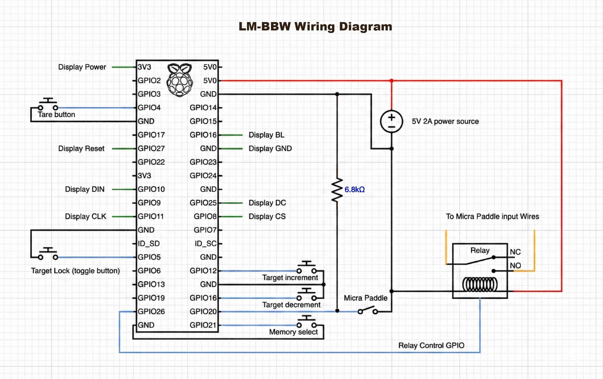
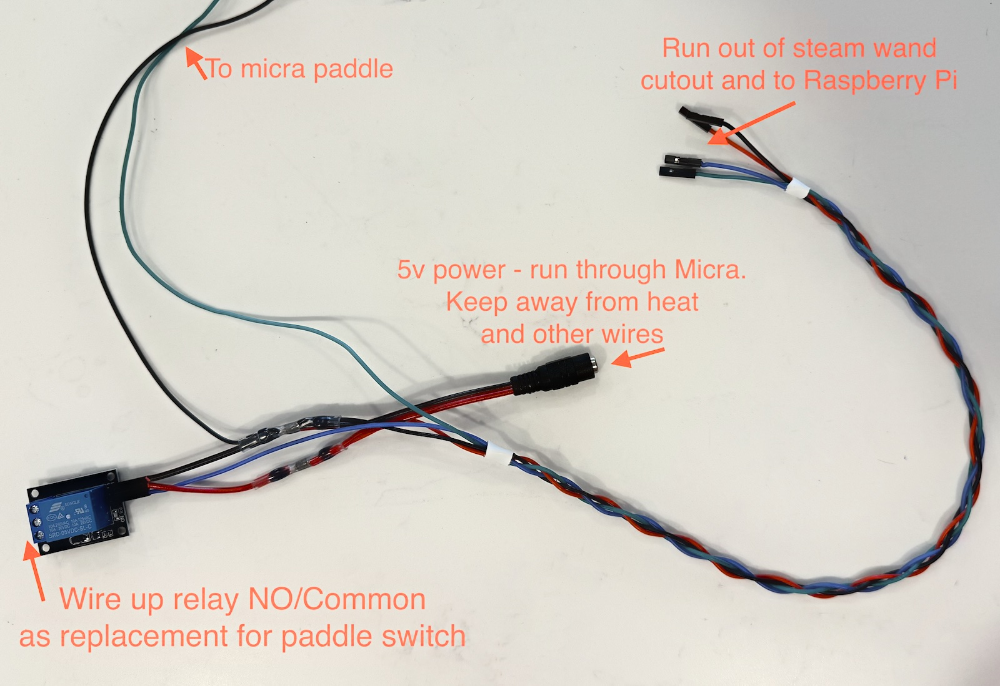
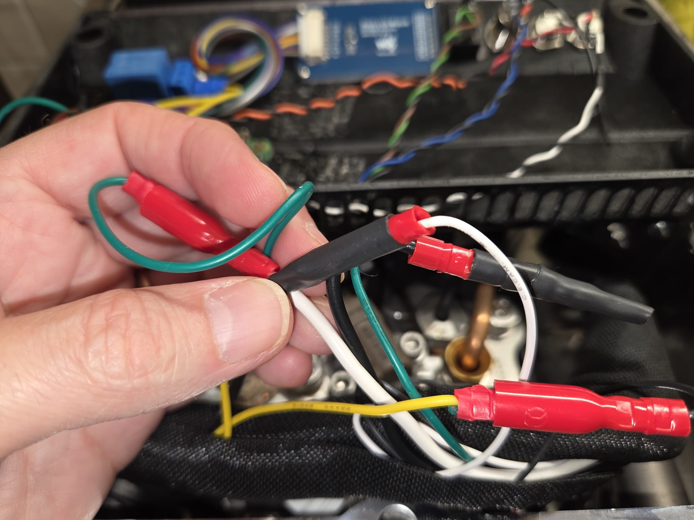
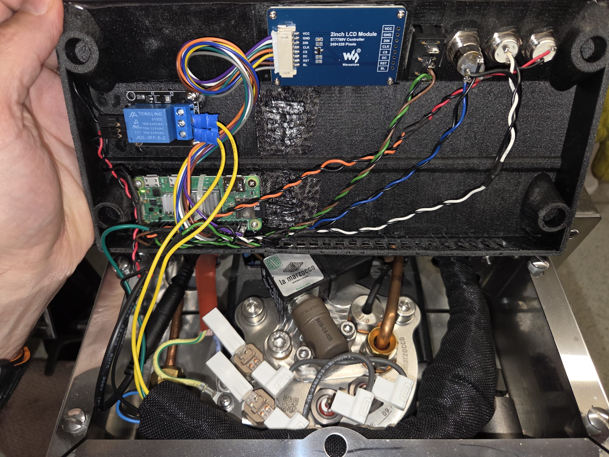

# LM-BBW — Brew-by-Weight for the La Marzocco Micra

LM-BBW adds **brew-by-weight** to the La Marzocco Linea Micra using a Bluetooth coffee scale. A small Raspberry Pi controller reads the scale over Bluetooth, displays the live shot, and acts as a proxy for the paddle switch — automatically stopping the shot when the cup reaches your target weight.

It works with **Acaia** scales (Lunar, Pyxis, Umbra) and **BooKoo** scales (Ultra, Mini), and can be adapted to almost any espresso machine + Bluetooth scale combination. Support for additional vendors can be added with a small driver module (see [Development](#development)).

> **Note:** This is a hobby project — a proof of concept being beaten into shape — so there is **no support**. Contributions are welcome, but it is built around my own needs; for customization, forking and making it your own is the best path.

This project was inspired by and originally based on Marcus Sorensen's [Apollo](https://github.com/mlsorensen/apollo) project — with deep gratitude and appreciation.

## Demo

▶️ **[Watch the demo video](../doc/lm-bbw/lm-bbw.mp4)** — LM-BBW landing a shot on target.


---

## Table of contents

- [Demo](#demo)
- [Features](#features)
- [How it works](#how-it-works)
- [Hardware](#hardware)
- [Software installation](#software-installation)
- [Configuration](#configuration)
- [Web interface](#web-interface)
- [Troubleshooting](#troubleshooting)
- [Project notes](#project-notes)
- [Development](#development)
- [Credits & license](#credits--license)

---

## Features

- **Brew-by-weight** — stops the shot automatically when the scale reaches the target weight (minus a learned drip-out margin).
- **Adaptive overshoot learning** — after each good shot, the controller self-calibrates the drip-out margin so future shots land closer to target. Each memory bank learns independently.
- **Three memory banks (A / B / C)** — each with its own target, learned overshoot, custom on-screen name, and accent color.
- **Live display** — weight, target, timer, battery, and a smoothed real-time flow-rate graph on a 2" SPI screen.
- **Shot history** — an image of every completed shot is saved and browsable through a built-in web gallery.
- **Multi-vendor scales** — works with Acaia (Lunar / Pyxis / Umbra) and BooKoo (Ultra / Mini); each brand has its own driver behind a common interface.
- **Scan & select** — a Bluetooth setup page scans for nearby scales and lets you pin a specific one; once pinned, only that scale is used and others are ignored. Unrecognized devices can be picked by address and assigned a brand.
- **Web configuration** — change settings from a browser; no SSH required.
- **Auto-connect / auto-sleep** — reconnects to the last known (or pinned) scale and idles gracefully (especially handy with the display-less Umbra).
- **Safety first** — paddle watchdog, emergency stop if the scale drops mid-shot, and a 60-second hard timeout.
- **Portrait or landscape** display orientation; supports the WaveShare 2.0" and 2.4" modules.

---

## How it works

The controller runs as a single main process (with background threads for the paddle watchdog, Bluetooth scanning, and the scale connection) plus a separate display process fed over a queue. It reads the paddle position, drives a relay that proxies the paddle circuit, streams weight from the scale, and decides when to cut the shot.

For a detailed breakdown of the processes, the shot lifecycle, the display state machine, and the configuration flow, see [**LM-BBW_Architecture.md**](../doc/lm-bbw/LM-BBW_Architecture.md).

---

## Hardware

### Bill of materials

> External links may not age well.

- Raspberry Pi Zero 2 W with soldered header (a Pi 3/4/5 also works)
- 5 V relay with 3.3 V-compatible logic control
- 5 V 2 A power supply
- 2.1 mm barrel-jack connector / wiring harness
- 2 × pushbutton switches
- 1 × toggle switch
- 1 × up/down rocker switch (or two more pushbuttons)
- 2" WaveShare 240×320 SPI display (or compatible)
- Screws: M2.0 / M2.5 4 mm, or #3-24 in 1/4", depending on your printer tolerances
- 24 AWG silicone hook-up wire
- Soldering tool and/or 2.54 mm crimping set
- 3D-printed enclosure, or your own alternative

### Controller

A Raspberry Pi was chosen so existing Python libraries can be reused without porting to a microcontroller. It also leaves plenty of room to expand functionality. I run the Lite Raspberry Pi OS image since no desktop GUI is needed. In my build I moved from a Pi Zero 2 W to a Pi 5 (overkill, underclocked to 1600 MHz) purely for smoother frame rates — a Pi 3 or 4 would be fine.

### Display

The software supports either the [WaveShare 2.0" display](https://www.waveshare.com/2inch-lcd-module.htm) or the [2.4" display](https://www.waveshare.com/2.4inch-lcd-module.htm). The 2.4" has worse viewing angles and is less sharp, and `display_size` must be updated in `main()`. **For compatibility with the included enclosure, use the 2" display.**

### Relay

There is no single specific relay. Any 5 V Arduino/Pi/ESP32-style relay should work — it will have common/NC/NO terminals on the load side and 5 V/GND/control on the logic side.

### Buttons

I use momentary pushbuttons for tare and memory, a toggle switch for "scale connect", and an up/down rocker for adjusting the target. The rocker behaves as two momentary switches sharing a common ground, so two separate buttons work equally well.

For the included enclosure, buttons should be 12 mm, and the rocker should be rectangular fitting a 19 mm × 13 mm opening. Rocker-switch quality varied a lot — some bounced badly — so I tried several and settled on the `MXU1-2-123`.

| Button | Function |
|--------|----------|
| Tare | Short press: tare the scale. Long press (5 s): restart the lm-bbw service |
| Memory | Rotate through memory banks A / B / C |
| Scale Connect | Connect / disconnect the scale |
| Target Inc | Increment target weight |
| Target Dec | Decrement target weight |
| Paddle | Start / stop the shot |

### Wiring



I crimped standard Dupont 2.54 mm connectors for easy wiring to the Pi header. To simplify power and control between the Micra and the controller, I built a custom harness that keeps the relay/switch ground and power inside the Micra, leaving just 4 pins back to the controller (5 V, GND, and one wire per IO).



The Micra paddle is reached by removing the four screws above the group head, exposing a bundle with black and white wires on bullet connectors. Insert the relay and Pi into this circuit to read the paddle state and control the machine.



### Enclosure

The enclosure STL is [here](../doc/lm-bbw/LM-top-full.stl). It may need fine-tuning for your printer's tolerances.

For smaller 3D pronters you can use the 2-piece design:

[Enclosure part 1](../doc/lm-bbw/LM-top-small.stl)

[Enclosure part 2](../doc/lm-bbw/LM-top-big-square.stl)
[Enclosure part 2 - another option](../doc/lm-bbw/LM-top-big-round.stl)

The display mounts with four screws, alongside the buttons.




---

## Software installation

Assumes a Raspberry Pi Debian OS is already installed. **Debian 13 (or newer), flashed with Raspberry Pi Imager, is recommended.**

### 1. Enable SPI and configure the Pi

Enable the SPI bus that drives the display:

```bash
sudo raspi-config
```

Choose **Interfacing Options → SPI → Yes**.

Free GPU memory for system use by setting it to 16 MB:

```bash
sudo nano /boot/firmware/config.txt
```

Add or modify the following line at the bottom (ideally under `[all]`):

```ini
gpu_mem=16
```

Disable the login UI:

```bash
sudo raspi-config
```

Under **System Options → Boot / Auto Login**, choose **Console**.

Reboot if you have not already:

```bash
sudo reboot
```

### 2. Install dependencies

```bash
sudo apt install -y git python3-pip python3-pandas python3-pil \
    python3-numpy python3-spidev python3-gpiozero python3-rpi.gpio libglib2.0-dev
sudo pip3 install simplepyble --break-system-packages
```

### 3. Install and start the service

```bash
git clone https://github.com/george-ags/lm-bbw.git
cd lm-bbw
sudo mkdir -p /opt/lm-bbw/web
sudo cp -r *.py lib /opt/lm-bbw/
sudo chmod +x /opt/lm-bbw/lm-bbw.py
sudo cp service/lm-bbw.service /etc/systemd/system/
sudo cp service/lm-bbw.env /etc/default/
sudo systemctl daemon-reload
sudo systemctl enable --now lm-bbw
```

By default the software scans for any supported scale nearby and connects to the first one found, then remembers its address and reconnects on subsequent starts. To force a specific scale (recommended when more than one is in range), use the Bluetooth setup page — see [Web interface](#web-interface).

To update an existing install, re-copy the code and restart:

```bash
sudo cp -r *.py lib /opt/lm-bbw/ && sudo systemctl restart lm-bbw
```

---

## Configuration

Settings are environment variables read at startup from `/etc/default/lm-bbw.env` (the repo copy is `service/lm-bbw.env`). Edit them either by hand or, more easily, through the [web interface](#web-interface). Either way, the service must restart for changes to take effect — the web UI does this automatically.

| Variable | Default | Description |
|----------|---------|-------------|
| `LOGLEVEL` | `INFO` | Logging verbosity (`DEBUG`, `INFO`, `WARNING`, …) |
| `DISPLAY_ORIENTATION` | `landscape` | Screen orientation: `landscape` or `portrait` |
| `DISPLAY_BRIGHTNESS` | `100` | Backlight brightness, percent |
| `REFRESH_RATE` | `0.1` | Main-loop / sampling interval in seconds (~10 Hz) |
| `GRAPH_HISTORY_SECONDS` | `60` | Seconds of flow history shown on the graph |
| `GRAPH_MAX_VALUE` | `4` | Top of the graph's y-axis, in g/s |
| `GRAPH_MAX_DENSITY_THRESHOLD` | `6` | Above this max value, only even gridlines are labelled |
| `FLOW_SMOOTHING_FACTOR` | `30` | Window size of the centered moving average applied to the flow line |
| `DRIP_OUT_WINDOW` | `3.5` | Seconds after the shot stops during which weight/graph keep updating for drip-out |
| `READY_SCREEN_TIMEOUT` | `180` | Idle seconds after which the screen reverts to the logo/ready view (stays connected) |
| `IDLE_TIMEOUT` | `300` | Idle seconds before full sleep: disconnect the scale and turn the screen off |
| `SLEEP_PAUSE` | `360` | Seconds to pause Bluetooth scanning after sleeping (lets the scale power off) |
| `ACTIVITY_WEIGHT_THRESHOLD` | `0.3` | Weight change (g) that counts as user activity for the idle timers |
| `MEMORY_A_NAME` / `B` / `C` | *(blank)* | Optional label shown instead of `TARGET A/B/C` (e.g. `Espresso`) |
| `MEMORY_A_COLOR` / `B` / `C` | `#ff1303` / `#25a602` / `#376efa` | Accent color per memory bank |

> Keep `READY_SCREEN_TIMEOUT` ≤ `IDLE_TIMEOUT` so the ready screen appears before the system fully sleeps.

---

## Web interface

The controller serves a small web app on **port 80** (`http://<pi-address>/`):

- **Shot history** — a gallery of saved shot images, newest first.
- **Bluetooth scale setup** — the 📶 icon opens `/scan`. It shows the currently connected scale, lets you scan for nearby scales, and pin a specific one to use (others are then ignored). A scale that's already connected appears separately (it stops advertising once connected, so it won't show in the scan list), and unrecognized devices can be selected by address with a brand chosen from a dropdown.
- **Configuration editor** — the gear icon (⚙️) opens `/config`, where every setting
in the table above can be edited. Saving writes the env file and restarts the service automatically.

---

## Troubleshooting

### Service fails to start — check Bluetooth

Confirm the adapter is found and powered on:

```bash
bluetoothctl show
```

You should see `Powered: yes`. If not, work through the steps below.

### Force the Bluetooth adapter on

Linux remembers a previous "blocked" state across reboots; clear it and force the adapter on:

```bash
sudo rfkill unblock all
sudo systemctl enable bluetooth
sudo systemctl start bluetooth
sudo bluetoothctl power on
```

Add a boot rule that forces power on as soon as the chip wakes up:

```bash
sudo nano /etc/udev/rules.d/10-local.rules
```

Add this exact line:

```
ACTION=="add", KERNEL=="hci0", RUN+="/usr/bin/bluetoothctl power on"
```

Save, exit, and reboot:

```bash
sudo reboot
```

Wait ~30 seconds, then verify again with `bluetoothctl show` (expect `Powered: yes`).

If it still says `Powered: no`, the Pi's UART driver is likely failing to load. Check the hardware-attach service:

```bash
sudo systemctl status hciuart
```

### Scanning stops working / scale won't connect

If the logs fill with `org.bluez` errors (e.g. `Path /org/bluez/... does not contain interface org.bluez.Adapter1`) and `bluetoothctl show` reports `Powered: no`, the Bluetooth controller has dropped. Bring it back up:

```bash
sudo systemctl stop lm-bbw
sudo rfkill unblock all
sudo hciconfig hci0 up 2>/dev/null || sudo systemctl restart bluetooth
sleep 3
bluetoothctl power on
bluetoothctl show | grep Powered     # expect: Powered: yes
sudo systemctl start lm-bbw
```

Having several scales (or other BLE devices) powered on at once increases connect/scan churn; pinning one scale on the setup page makes startup more predictable.

---

## Project notes

### Umbra support

The Acaia Umbra is very similar to the Lunar but has no display or onboard controls, which makes it ideal for integrations — it's cheaper, there are no controls to bump, and the blank slab looks clean. It also has a sleep mode, so LM-BBW can connect only when needed and let the scale sleep when disconnected; you rarely need to touch it except to charge or clean.

To support this, the former "target lock" toggle was repurposed as a **scale connect** button (I never used the lock in over a year). Engaged, it connects to the scale and turns the screen on; disengaged, it disconnects and turns the screen off. For a regular Lunar, just leave the toggle engaged and continue powering the scale on/off as before.

---

## Development

A high-level architecture overview — processes, threads, the shot lifecycle, the display state machine, and the configuration flow — is in [LM-BBW_Architecture.md](../doc/lm-bbw/LM-BBW_Architecture.md).

### ControlManager (`lib/control.py`)

Owns the physical devices: defines the buttons, holds state (targets, memory banks, relay), runs the paddle watchdog, and maintains scale connectivity.

### Display (`lib/display.py`)

Defines how the screen is drawn, updates the physical display, and saves images of finished shots. It runs in a separate process so rendering never blocks control or Bluetooth logic — the main loop pushes the latest data onto a queue, which the display process drains each refresh. Graph rendering uses simple lines (a deliberate choice after matplotlib proved too CPU-heavy and other libraries had their own drawbacks).

### Main loop (`lm-bbw.py`)

Sets up the Display and ControlManager, then orchestrates data collection, the target-weight cutoff, overshoot learning, and state updates.

### Scale drivers (`lib/scales.py`, `lib/scale_acaia.py`, `lib/scale_bookoo.py`)

Each vendor has its own driver exposing a common interface (`connect`, `disconnect`, `tare`, and `mac` / `connected` / `weight` / `battery` / `units`). `scales.py` is the vendor-neutral layer: a combined scanner that tags each device with its brand, a factory, and a `Scale` wrapper that delegates to the right backend and can switch vendors in place. To add a new vendor, write a driver with the same interface and register its advertised-name prefix and constructor in `scales.py`. All BLE scans are serialized through a single lock in `lib/ble.py` so the adapter is never scanned by two code paths at once.

---

## Credits & license

- Inspired by and originally based on [Apollo](https://github.com/mlsorensen/apollo) by Marcus Sorensen.
- BooKoo scale support is based on BooKoo's published protocol specs (`lib/BooKooCode/OpenSource/`).
- The WaveShare LCD drivers (`lib/lcdconfig.py`, `lib/LCD_2inch*.py`) are by the WaveShare team and retain their original MIT license.

This is a personal hobby project provided as-is, without warranty. If you intend to redistribute it, please add an explicit project license. If you are a commercial organization and want to use this project please contact me.